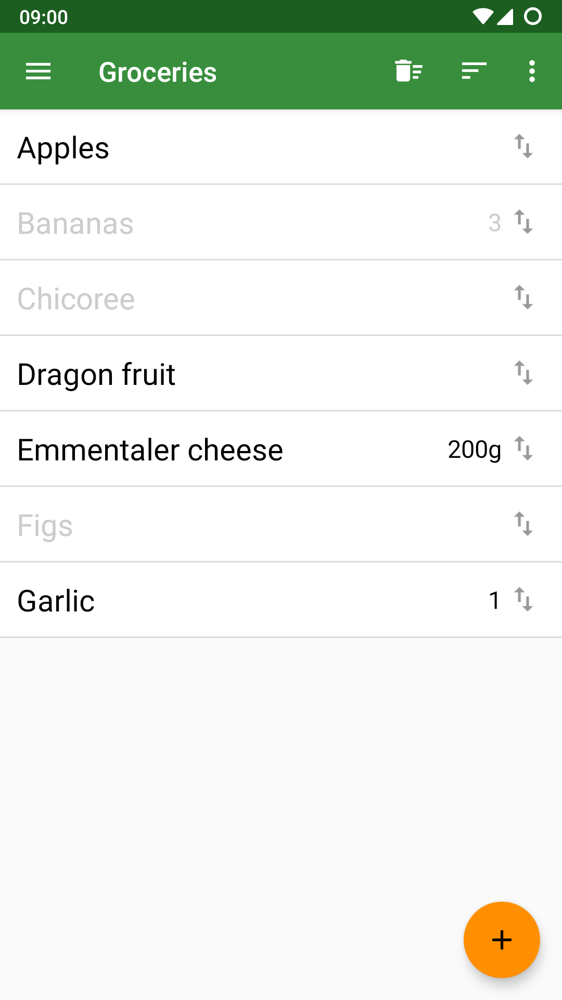
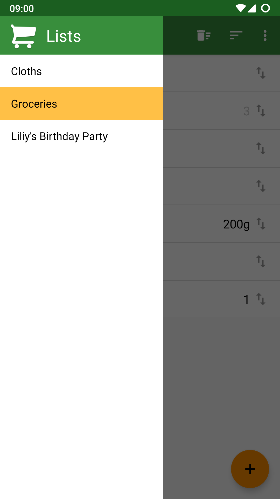

<h1 align="center"><br/> ShoppingList</h1>
A simple shopping list for Android

<p float="left">
  
  
</p>

<a href="https://f-droid.org/packages/com.woefe.shoppinglist/" target="_blank">
    
</a>

## ShoppingList text file
ShoppingList saves your shopping lists as a plain text files.
The syntax of a ShoppingList file is quite simple and easy to read and edit.

### Syntax
 * The very first line of the file is the name of the list in square brackets
 * Empty lines or lines with only white spaces are ignored
 * Every item of the list corresponds to a single line in the file
 * Checked items start with `//`
 * Specifying the amount of an item is optional
 * The amount of an item and its name are separated by the #-Sign

### Example
```
[ ShoppingList ]

Milk
Bananas #
Juice #2 Liters
// Eggs #12
```

## Synchronization
To synchronize the lists select a folder in the ShoppingList settings which gets synchronized by whichever sync-software you use.
The ShoppingList app will automatically detect lists (and changes to the lists) that show up in the folder.
Note that unfortunately most synchronisation solutions on Android cannot continuously watch and synchronize the folder.

### Nextcloud Example
1. Create a `shoppinglists` folder in your Nextcloud
2. Sync this folder to your Nextcloud files app.
3. Go to ShoppingList settings and find this folder on your Android file system (e.g. `/storage/emulated/0/Android/media/com.nextcloud.client/nextcloud/user@cloud.kom/shoppinglists`)
4. If you want to sync the lists, open the Nextcloud files app and synchronize the shopping list folder

Better Integration with Nextcloud is [planned](https://github.com/woefe/ShoppingList/issues/17).
